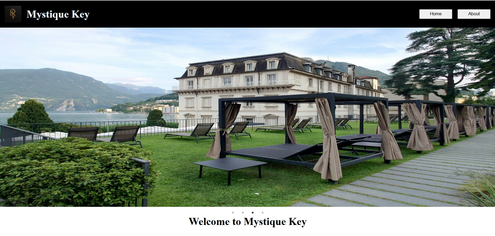
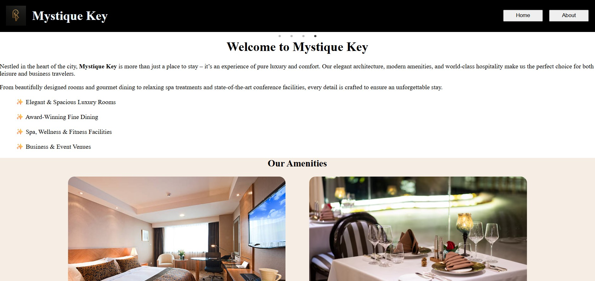

# 🏨 Mystique Hotel Website

A modern, responsive **hotel website built using React and Vite**, showcasing rooms, dining, spa services, and event facilities.
This project demonstrates **clean UI design, reusable components, and client-side routing** to simulate a real hotel website experience.

---

## 🌐 Live Demo

👉 https://keerthisaranya17.github.io/Hotel_Page

---

# 🏨 Mystique Hotel Website

A modern, responsive **hotel website built using React and Vite**, showcasing rooms, dining, spa services, and event facilities.
This project demonstrates **clean UI design, reusable components, and client-side routing** to simulate a real hotel website experience.

---

## 🌐 Live Demo

👉 https://keerthisaranya17.github.io/Hotel_Page

---

## 📸 Screenshots

### 🏠 Home Page




### 🛏️ Accommodations


### 🍽️ Dining Options


### 🧖 Spa & Swimming


### 📞 Contact


---

## ✨ Features

* 🏠 Elegant and responsive home page
* 🛏️ Room categories with images and descriptions
* 🍽️ Dining options showcase
* 🧖 Spa & swimming facilities section
* 🎉 Meetings & events page
* 📞 Contact section for inquiries
* 🔄 Smooth navigation using React Router
* 🧩 Reusable component-based architecture

---

## 🧩 Component Structure

The application is structured using reusable React components:

* `NavBar`
* `HotelSlider`
* `Accommodations`
* `DiningOptions`
* `SpaAndSwimming`
* `MeetingAndEvents`
* `Contact`

This approach ensures **clean code organization and scalability**.

---

## 🛠️ Tech Stack

### Frontend

* React.js
* JavaScript (ES6+)
* HTML5
* CSS3

### Routing

* React Router DOM

### Build Tool

* Vite

### Development Tools

* Git
* GitHub
* ESLint

---

## 📂 Project Structure

```
Hotel_Page
│
├── public/                 # Static assets
├── src/
│   ├── Components/         # React components
│   │   ├── NavBar.jsx
│   │   ├── HotelSlider.jsx
│   │   ├── Accommodations.jsx
│   │   ├── DiningOptions.jsx
│   │   ├── SpaAndSwimming.jsx
│   │   ├── MeetingAndEvents.jsx
│   │   └── Contact.jsx
│   │
│   ├── assets/             # Images and media
│   ├── App.jsx             # Main app component
│   ├── main.jsx            # Entry point
│   └── App.css             # Styles
│
├── index.html
├── package.json
├── vite.config.js
└── README.md
```

---

## ⚙️ Getting Started

### 1. Clone the repository

```bash
git clone https://github.com/KeerthiSaranya17/Hotel_Page.git
```

### 2. Navigate to the project folder

```bash
cd Hotel_Page
```

### 3. Install dependencies

```bash
npm install
```

### 4. Run the development server

```bash
npm run dev
```

### 5. Open in browser

```
http://localhost:5173
```

---

## 🎯 Purpose of the Project

This project was created to practice:

* Building UI using **React components**
* Structuring applications with **Vite**
* Creating a **responsive hotel website layout**
* Implementing **client-side routing**
* Designing **clean and modular front-end architecture**

---

## 🚧 Future Improvements

* Add room booking functionality
* Backend integration (Node.js / APIs)
* User authentication system
* Payment gateway integration
* Admin dashboard for hotel management

---

## 👩‍💻 Author

**Keerthi Saranya**

* GitHub: https://github.com/KeerthiSaranya17
* LinkedIn: https://www.linkedin.com/in/keerthi-saranya-muttha-b380ba287/

---

⭐ If you like this project, consider giving it a **star on GitHub**!


## ✨ Features

* 🏠 Elegant and responsive home page
* 🛏️ Room categories with images and descriptions
* 🍽️ Dining options showcase
* 🧖 Spa & swimming facilities section
* 🎉 Meetings & events page
* 📞 Contact section for inquiries
* 🔄 Smooth navigation using React Router
* 🧩 Reusable component-based architecture

---

## 🧩 Component Structure

The application is structured using reusable React components:

* `NavBar`
* `HotelSlider`
* `Accommodations`
* `DiningOptions`
* `SpaAndSwimming`
* `MeetingAndEvents`
* `Contact`

This approach ensures **clean code organization and scalability**.

---

## 🛠️ Tech Stack

### Frontend

* React.js
* JavaScript (ES6+)
* HTML5
* CSS3

### Routing

* React Router DOM

### Build Tool

* Vite

### Development Tools

* Git
* GitHub
* ESLint

---

## 📂 Project Structure

```
Hotel_Page
│
├── public/                 # Static assets
├── src/
│   ├── Components/         # React components
│   │   ├── NavBar.jsx
│   │   ├── HotelSlider.jsx
│   │   ├── Accommodations.jsx
│   │   ├── DiningOptions.jsx
│   │   ├── SpaAndSwimming.jsx
│   │   ├── MeetingAndEvents.jsx
│   │   └── Contact.jsx
│   │
│   ├── assets/             # Images and media
│   ├── App.jsx             # Main app component
│   ├── main.jsx            # Entry point
│   └── App.css             # Styles
│
├── index.html
├── package.json
├── vite.config.js
└── README.md
```

---

## ⚙️ Getting Started

### 1. Clone the repository

```bash
git clone https://github.com/KeerthiSaranya17/Hotel_Page.git
```

### 2. Navigate to the project folder

```bash
cd Hotel_Page
```

### 3. Install dependencies

```bash
npm install
```

### 4. Run the development server

```bash
npm run dev
```

### 5. Open in browser

```
http://localhost:5173
```

---

## 🎯 Purpose of the Project

This project was created to practice:

* Building UI using **React components**
* Structuring applications with **Vite**
* Creating a **responsive hotel website layout**
* Implementing **client-side routing**
* Designing **clean and modular front-end architecture**

---

## 🚧 Future Improvements

* Add room booking functionality
* Backend integration (Node.js / APIs)
* User authentication system
* Payment gateway integration
* Admin dashboard for hotel management

---

## 👩‍💻 Author

**Keerthi Saranya**

* GitHub: https://github.com/KeerthiSaranya17
* LinkedIn: https://www.linkedin.com/in/keerthi-saranya-muttha-b380ba287/

---

⭐ If you like this project, consider giving it a **star on GitHub**!
